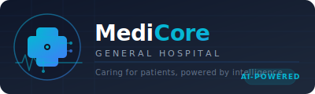

<p align="center">
  
</p>

<p align="center">
  <a href="https://hospital-management-app-wine.vercel.app"></a>
  
  
  
  
  
</p>

<p align="center">
  <strong>A full-stack Hospital Management System built to teach Claude Code's most powerful features:</strong><br/>
  Skills &bull; Agents &bull; Hooks &bull; MCP (Trello + Pencil)
</p>

---

## Overview

**MediCore General Hospital** is a production-grade MERN application for a fictional mid-size hospital. Patients book appointments, doctors manage electronic health records, nurses track ward occupancy, and all clinical staff can query an **AI assistant trained on the hospital's own clinical protocols**.

The project is designed as a **teaching vehicle** — every architectural decision was made to showcase a Claude Code feature in context.

---

## Live Demo

| Environment | URL |
|-------------|-----|
| Production (Vercel) | [hospital-management-app-wine.vercel.app](https://hospital-management-app-wine.vercel.app) |
| Local Dev | `http://localhost:5173` |

**Demo credentials:**

| Role | Email | Password |
|------|-------|----------|
| Admin + Doctor | `admin@medicore.hospital` | `Admin1234!` |

---

## Features

### Core Application

| Module | Description |
|--------|-------------|
| Auth | JWT register/login/logout; six roles: Admin, Doctor, Nurse, Patient, Receptionist, Lab Technician |
| Patient Management | Demographics, emergency contacts, allergies, insurance details |
| Appointment Scheduling | Book, confirm, cancel, reschedule; doctor availability slots |
| Electronic Health Records | Visit notes, ICD-10 diagnoses, vitals, treatment plans, linked prescriptions and lab orders |
| Medication & Pharmacy | Create prescriptions, dispensing log, medication stock levels, expiry alerts |
| Lab & Diagnostics | Order tests, upload result files (Cloudinary), flag abnormal values, link to EHR |
| Billing & Invoicing | Itemised invoices, insurance claim details, payment status tracking |
| Ward & Bed Management | Real-time bed occupancy grid, admit/discharge flow |
| Notifications | Email appointment reminders and discharge summaries via Nodemailer + node-cron |

### Six AI Features (Claude API)

| # | Feature | Model | Mode |
|---|---------|-------|------|
| 1 | **Differential Diagnosis** | Claude Sonnet | Streaming SSE, ranked diagnoses with confidence scores |
| 2 | **Medical Record Summarisation** | Claude Haiku | JSON mode, cached on `Patient.aiSummary` |
| 3 | **Discharge Summary Generator** | Claude Sonnet | Streaming, saved to Cloudinary |
| 4 | **Medication Interaction Checker** | Claude Haiku | JSON mode, checked before every prescription save |
| 5 | **Natural Language Appointment Scheduling** | Claude Haiku | JSON intent parsing |
| 6 | **Clinical Protocol RAG Chatbot** | Haiku + Sonnet | Two-model pipeline: keyword extraction → MongoDB `$text` search → synthesis with citations |

---

## Tech Stack

| Layer | Technology |
|-------|-----------|
| Frontend | React 18 + Vite (port 5173) + Tailwind CSS |
| Backend | Node.js + Express REST API (port 5000) |
| Database | MongoDB Atlas + Mongoose |
| Auth | JWT + bcryptjs |
| File Storage | Cloudinary (lab reports, X-rays, scan PDFs) |
| Email | Nodemailer + Gmail SMTP |
| Scheduling | node-cron (appointment reminders, expiry alerts) |
| AI | Anthropic Claude API (server-side only) |
| RAG Store | MongoDB `ProtocolChunk` collection (no external vector DB — MongoDB `$text` search + Claude synthesis) |
| Unit Testing | Vitest + React Testing Library |
| Integration Tests | Supertest + mongodb-memory-server |
| E2E | Playwright |
| CI/CD | GitHub Actions |
| Deployment | Vercel (serverless Express adapter) |

---

## Architecture

```
Hospital-MGMT-App/
├── api/
│   └── index.js              # Vercel serverless entry (Express adapter)
├── client/                   # React 18 + Vite frontend
│   ├── src/
│   │   ├── api/axios.js      # Axios instance with JWT interceptor
│   │   ├── components/       # AIAssistantPanel, DiagnosisChatbot, InteractionWarning …
│   │   ├── context/          # AuthContext
│   │   ├── hooks/useSSE.js   # Server-Sent Events hook for AI streaming
│   │   └── pages/            # Dashboard, EHR, Billing, Appointments …
│   ├── .env.development      # VITE_API_URL=http://localhost:5000/api
│   └── .env.production       # VITE_API_URL=/api
├── server/                   # Node.js + Express backend
│   ├── src/
│   │   ├── app.js            # Express app (no server startup)
│   │   ├── index.js          # Local dev startup (dotenv + listen)
│   │   ├── config/           # DB, Cloudinary, Anthropic SDK, Nodemailer
│   │   ├── controllers/      # 10 controllers incl. aiController.js
│   │   ├── middleware/       # JWT auth, RBAC, audit logging, rate limiting
│   │   ├── models/           # 9 Mongoose schemas
│   │   ├── routes/           # 11 route files
│   │   └── scripts/          # ingestProtocols.js, seedDatabase.js, createProdAdmin.js
│   └── tests/
│       ├── unit/             # Vitest — mocked Anthropic SDK + Cloudinary
│       └── integration/      # Supertest + mongodb-memory-server
├── e2e/                      # Playwright end-to-end tests
├── docs/
│   └── logo.svg              # Brand mark
└── vercel.json               # Serverless deployment config
```

---

## Getting Started

### Prerequisites

```bash
node --version    # 18+
git --version
```

You also need accounts on:
- **MongoDB Atlas** — free tier cluster
- **Cloudinary** — free tier (lab report uploads)
- **Anthropic** — API key for AI features
- **Gmail** — App Password for SMTP email

### Installation

```bash
# 1. Clone the repository
git clone https://github.com/pirgan/Hospital-Management-App.git
cd Hospital-Management-App

# 2. Install backend dependencies
cd server && npm install

# 3. Install frontend dependencies
cd ../client && npm install
```

### Environment Configuration

Create `server/.env` from the example:

```bash
cp server/.env.example server/.env
```

Fill in your values:

```env
MONGODB_URI=mongodb+srv://<user>:<pass>@cluster.mongodb.net/hospital-mgmt-app
JWT_SECRET=<generate with: openssl rand -hex 64>
ANTHROPIC_API_KEY=sk-ant-...
CLOUDINARY_CLOUD_NAME=...
CLOUDINARY_API_KEY=...
CLOUDINARY_API_SECRET=...
EMAIL_USER=your@gmail.com
EMAIL_PASS=<gmail app password>
CLIENT_URL=http://localhost:5173
PORT=5000
```

### Running Locally

```bash
# Terminal 1 — Backend (port 5000)
cd server && npm run dev

# Terminal 2 — Frontend (port 5173)
cd client && npm run dev
```

### Seed the Database

```bash
# Create admin/doctor user
cd server && npm run create:admin

# Seed all collections with sample data
cd server && node scripts/seedDatabase.js

# Ingest clinical protocols into the RAG store
cd server && node scripts/ingestProtocols.js
```

---

## Testing

```bash
# All tests
npm test

# Unit tests only (mocked external services)
cd server && npm run test:unit
cd client && npm run test:unit

# Integration tests (in-memory MongoDB)
cd server && npm run test:integration

# E2E tests (requires running dev server)
cd e2e && npx playwright test

# Coverage report
cd server && npm run check-coverage
```

Coverage targets: **80% lines / 75% branches**

---

## Deployment

Uses the `/deploy` Claude Code skill which runs the full pipeline:

```
Tests → Build → Vercel → GitHub Release
```

### Manual Deploy

```bash
# Build frontend
cd client && npm run build

# Deploy to Vercel
vercel --prod --yes
```

### Vercel Environment Variables Required

| Variable | Description |
|----------|-------------|
| `MONGODB_URI` | MongoDB Atlas connection string (include `/hospital-mgmt-app` database name) |
| `JWT_SECRET` | Same secret as local — must match to validate tokens cross-environment |
| `ANTHROPIC_API_KEY` | Anthropic API key |
| `CLOUDINARY_CLOUD_NAME` | Cloudinary config |
| `CLOUDINARY_API_KEY` | Cloudinary config |
| `CLOUDINARY_API_SECRET` | Cloudinary config |
| `CLIENT_URL` | Your Vercel deployment URL (no trailing slash or newline) |

---

## Claude Code Features Demonstrated

This project was built specifically to teach the following Claude Code capabilities:

### Skills (Custom Slash Commands)

| Skill | What It Does |
|-------|-------------|
| `/scaffold-server` | Generates the full Express backend from a spec |
| `/scaffold-client` | Generates the full React + Vite frontend |
| `/create-user-stories <feature>` | Generates Gherkin stories + creates Trello cards automatically |
| `/run-tests` | Runs the full test suite with coverage |
| `/check-coverage` | Coverage report with pass/fail thresholds |
| `/create-release-notes <tag>` | Auto-generates release notes from git history |
| `/deploy` | Complete pipeline: tests → build → Vercel → GitHub Release |

### Agents

Autonomous sub-processes with scoped tool access used for:
- Parallel test execution across server and client
- Database seeding with schema-aware data generation
- Release note extraction from git history

### Hooks

Shell commands that auto-run on Claude Code events:
- **PreToolUse** — lint check before file writes
- **PostToolUse** — auto-format after edits
- **Notification** — desktop alerts on long-running task completion

### MCP Integrations

| Server | Usage |
|--------|-------|
| **Trello MCP** | Create user stories and populate the project backlog directly from the terminal |
| **Pencil MCP** | Generate UI wireframes and component prototypes with a single prompt |

---

## User Roles & Permissions

| Role | Key Permissions |
|------|----------------|
| `admin` | Full system access, user management, analytics |
| `doctor` | EHR, prescriptions, lab orders, all AI features |
| `nurse` | Vitals entry, ward management, medication dispensing |
| `patient` | View own appointments, records, invoices |
| `receptionist` | Patient registration, appointment booking |
| `lab_tech` | Process lab orders, upload results to Cloudinary |

---

## API Reference

All endpoints require `Authorization: Bearer <token>` except auth routes.

| Method | Endpoint | Description |
|--------|----------|-------------|
| POST | `/api/auth/login` | Login, returns JWT |
| POST | `/api/auth/register` | Register new user |
| GET | `/api/patients` | List patients |
| POST | `/api/patients` | Create patient |
| GET | `/api/appointments` | List appointments |
| GET | `/api/medical-records/:patientId` | Patient EHR |
| POST | `/api/prescriptions` | Create prescription (triggers interaction check) |
| GET | `/api/lab-orders` | List lab orders |
| GET | `/api/invoices` | List invoices |
| GET | `/api/wards` | Ward occupancy |
| POST | `/api/ai/differential-diagnosis` | AI diagnosis (streaming) |
| POST | `/api/ai/summarize-record` | Summarise EHR (JSON) |
| POST | `/api/ai/discharge-summary` | Discharge summary (streaming) |
| POST | `/api/ai/check-interactions` | Drug interaction check (JSON) |
| POST | `/api/ai/schedule-appointment` | NL appointment scheduling |
| POST | `/api/ai/protocol-chat` | RAG chatbot query |
| GET | `/health` | Health check |

---

## Project Structure — Key Files

| File | Purpose |
|------|---------|
| `server/src/app.js` | Express app factory (imported by both local dev and Vercel) |
| `server/src/index.js` | Local dev only — dotenv + `app.listen()` |
| `api/index.js` | Vercel serverless handler — lazy DB connect, no dotenv |
| `server/src/controllers/aiController.js` | All 6 AI features |
| `server/src/middleware/auditMiddleware.js` | Write-op audit logging |
| `server/src/middleware/rateLimit.js` | 10 req/min on `/api/ai/*` |
| `client/src/hooks/useSSE.js` | SSE streaming hook for differential diagnosis |
| `client/src/components/AIAssistantPanel.jsx` | Streaming diagnosis UI |
| `client/src/components/DiagnosisChatbot.jsx` | Floating RAG chatbot |
| `vercel.json` | Serverless config — routes, build command, function bundling |

---

## Contributing

This is a teaching project. Issues and PRs that improve the learning experience are welcome.

```bash
# Commit message format
feat: add new feature
fix: resolve a bug
chore: dependency updates
test: add or update tests
docs: documentation changes
```

---

## License

MIT — free to use for learning and teaching.

---

<p align="center">
  
  <br/>
  <sub>Built with Claude Code &bull; Anthropic</sub>
</p>
